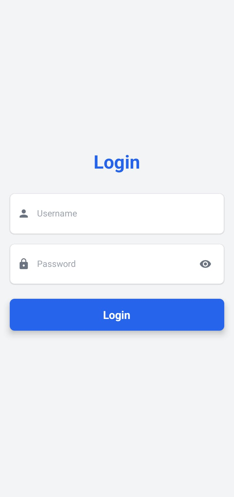
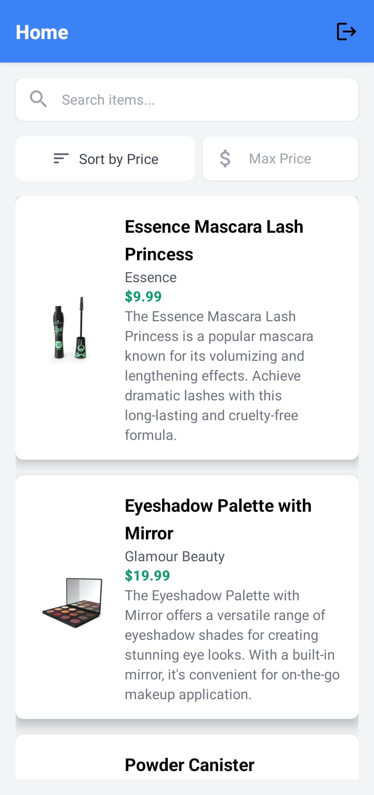
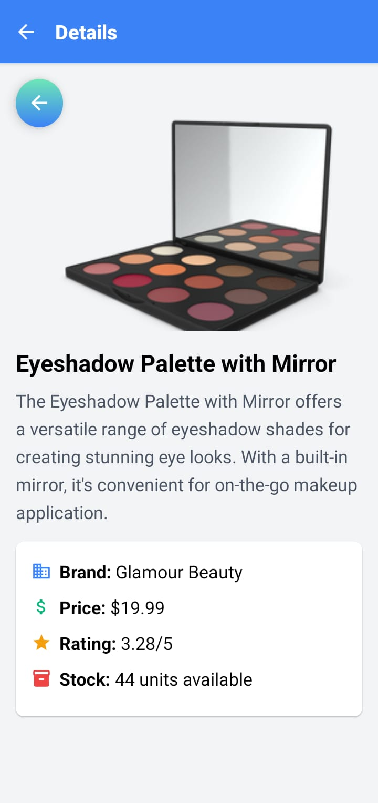

# DataFetchr

DataFetchr is a simple mobile application built using **React Native**, **Tailwind CSS**, and **React Navigation**. The app fetches and displays data from an external API and consists of three main screens: **Login**, **Home**, and **Details**.

## Features

**Login Screen:**
Authenticates users using a dummy API.

**Home Screen:**
Displays a list of items fetched from an API in a stylized card layout.

**Details Screen:**
Shows detailed information about a selected item.

**Responsive Design:**
Built using Tailwind CSS for consistent styling across devices.

**Navigation:**
Smooth transitions between screens using React Navigation.

**Error Handling:** Proper error messages for failed API requests.

## Bonus Features:

1. Logout functionality.

2. Persistence of authentication token using AsyncStorage.

3. Search bar to filter items.

4. Infinite scrolling or pagination (optional).

## Prerequisites

Before running the project, ensure you have the following installed:

1. Node.js (v16 or higher)

2. Expo CLI (if using Expo)

3. Git

4. A code editor (e.g., VS Code)

## Installation
Follow these steps to set up and run the project locally:

1. Clone the Repository
Clone the repository to your local machine using the following command:

bash
git clone https://github.com/Tapu-Parida2004/DataFetchr.git
Navigate to the project directory:

bash
cd DataFetchr
2. Install Dependencies
Install all the required dependencies by running:

bash
npm install
3. Set Up Tailwind CSS
To use Tailwind CSS for styling, follow these steps:

Install the required Tailwind CSS package for React Native:

bash
npm install tailwind-react-native-classnames
Configure Tailwind CSS by creating a tailwind.config.js file and importing it into your project. Refer to the Tailwind CSS documentation for detailed setup instructions.

4. Run the App
For Expo
Start the development server using Expo:

bash
npm start
Scan the QR code with the Expo Go app on your mobile device.

Alternatively, you can run the app on an Android or iOS emulator.

For React Native CLI
If you're using React Native CLI, run the app on an Android or iOS emulator:

Android:

bash
npx react-native run-android
iOS:

bash
npx react-native run-ios

# Project Structure

DataFetchr/
├── assets/ # Images and other static assets
├── components/ # Reusable components
├── screens/ # Application screens
│ ├── LoginScreen.js # Login screen
│ ├── HomeScreen.js # Home screen
│ └── DetailsScreen.js # Details screen
├── navigation/ # React Navigation setup
├── utils/ # Utility functions (e.g., API calls)
├── App.js # Main application file
├── tailwind.config.js # Tailwind CSS configuration
├── package.json # Project dependencies
└── README.md # Project documentation
└── screenshots # screenshots 

## API Integration

The app uses the following API endpoints:

**Login API:**

URL: POST https://dummyjson.com/auth/login

Body: { "username": "test_user", "password": "test_user_password" }

Response: Stores the authentication token and navigates to the Home screen.

**Items API:**

URL: GET https://dummyjson.com/products

Response: Fetches a list of items displayed on the Home screen.

**Item Details API:**

URL: GET https://dummyjson.com/products/{id}

Response: Fetches detailed information about a specific item.

## Screens

1. Login Screen
   Users enter their email and password.

On successful login, the user is navigated to the Home screen.

Uses a dummy authentication API for login.

2. Home Screen
   Fetches and displays a list of items from the API.

Each item is displayed in a stylized card using Tailwind CSS.

Clicking on an item navigates to the Details screen.

3. Details Screen
   Displays detailed information about the selected item.

Includes a "Back" button to return to the Home screen.

## Bonus Features (Optional)

**Logout Button:**

Clears user data and redirects to the Login screen.

**AsyncStorage:**

Persists the authentication token for seamless user experience.

**Search Bar:**

Filters the list of items on the Home screen.

**Infinite Scrolling/Pagination:**

Loads more items as the user scrolls (optional).

## Code Quality

Modular Code: Components are reusable and well-organized.

Comments: Code is documented for clarity.

Error Handling: Proper error messages are displayed for failed API requests.

State Management: Uses React's built-in state management or Context API.

## Screenshots

| Login Screen | Home Screen | Details Screen |
|--------------|-------------|----------------|
|  |  |  |

## Running the Project

Start the development server:

expo start
Scan the QR code using the Expo Go app on your mobile device or use an emulator.

Test the app:

Login with the provided credentials.

Browse the list of items on the Home screen.

Click on an item to view its details.

## License

This project is licensed under the MIT License. See the LICENSE file for details.

## Acknowledgments

React Native

Tailwind CSS

React Navigation

DummyJSON API
